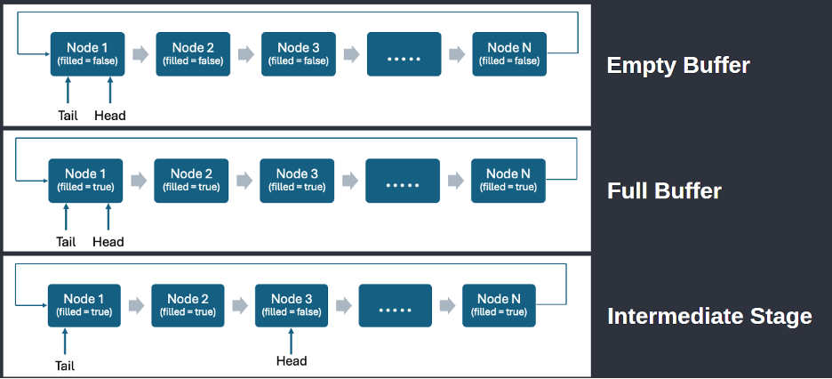

# Designing and implementing Infinite Buffer using Dynamic Memory Allocation with comparative performance analysis with respect to Finite Buffer


## Problem Statement
Implement an infinite buffer that dynamically allocates memory as needed to handle an unbounded number of items. Use synchronization mechanisms to manage producer and consumer access to the buffer. 

- Implement dynamic memory allocation for the buffer to handle an unbounded number of items.
- Use synchronization mechanisms (e.g., semaphores or monitors) to ensure proper access to the buffer.
- Add support for multiple producers and consumers.
- Implement logging to track buffer operations (e.g., insertions, deletions, and memory usage).
- Compare the performance of the infinite buffer implementation with a fixed-size buffer.


## Objectives

- To design and implement an infinite buffer using dynamic memory allocation.
- To support multiple producers and consumers concurrently along with ensuring that our data structure integrity is not damaged. To do this, we use proper synchronization mechanisms.
- To develop a fixed-size buffer implementation for comparison.
- To incorporate logging and metrics tracking for operations and memory usage. This will allow us to do a comparison between the infinite and fixed-size buffer implementations.
- To evaluate the trade-offs between the infinite buffer implementation and the fixed buffer implementation.

## Design Overview
###  Infinite Buffer Design
The infinite buffer is implemented using a singly linked list data structure with dynamic memory allocation. It starts with a dummy node. This simplifies the coding part. Producers add items by filling the current head node and then creating a new empty node and shifting the head pointer. Consumers consume items from the tail and delete nodes after use and free the memory.

This architecture for the infinite buffer case ensures:
- The buffer size is only limited by available system memory. This is an approximation of an infinite buffer.
- Separate head and tail pointers enable concurrent producer and consumer operations. Due to this the producers do not have to wait for consumers to free the buffer memory before they can produce the next item.
- Dual mutex locks (one for producers and one for consumers) also ensure that producers do not have to wait for consumers to free the buffer memory before they can produce the next item.

### Fixed Buffer Design
The fixed buffer uses a circular linked list with a pre-defined number of nodes. The size of the linked list stays constant here unlike the infinite buffer. Producers have to wait when the buffer is full, and consumers have to wait when it is empty.

This architecture for the finite buffer case ensures:

- No dynamic allocation after initialization. This leads to only a constant amount of memory being used at a given time.
- Since we have only a finite amount of space, producers have to wait for consumers to free the buffer memory before they can produce the next item.
- But on the other hand, constant memory usage helps in making the system predictable. So, the process is restricted from taking up a very large chunk of the memory.

## Synchronization Mechanisms
### Infinite Buffer
<b>Dual Mutexes:</b>
Since the buffer is unbounded, producers never have to wait for space. This allows us to have two independent mutexes for producers and consumers.

- TicketLock: Ensures mutual exclusion with FIFO fairness for producer operations (adding items to the buffer).
- mutex_consumer: Ensures mutual exclusion for consumer operations (removing items from the buffer)

<b>TicketLock</b>
Here we have implemented our own synchronization primitive TicketLock.

Its mechanism is shown below:

Ticket Assignment:  
int my_ticket = next_ticket++; // Atomic increment  

Each producer receives a unique ticket on lock request.

Wait for Turn: 

``` 
while (now_serving != my_ticket) {`
                   this_thread::yield(); // Avoids busy-wait  
}
```

Producers wait until their ticket is called:
now_serving++; // Atomic increment  
Unlocks the next producer in line.

A diagram showing this is given below:


Condition Variable (cv_not_empty): Used by consumers to wait if the buffer is empty.

Mutexes used for logging operations (prod_stat_mutex, cons_stat_mutex): Used to safely record performance metrics without interfering with buffer operations.


<b>Fixed Buffer</b>
Mutexes: Here also we use separate mutexes for producer and consumer operations. We are able to do this because we use condition variables to ensure that the produce and consume operations happen only when they are legal.

- TicketLock: TicketLock ensures fair FIFO ordering of producers.
- mutex_producer: Ensures that only one producer among all producers can access and modify the buffer at a time.
- mutex_consumer: Ensures that only one consumer among all consumers can access and modify the buffer at a time.
Two Condition Variables:
- cv_not_empty: Ensures consumers wait until data is available.
- cv_not_full: Ensures producers wait until there is space to insert data.
- 
Mutexes used for logging operations (prod_stat_mutex, cons_stat_mutex): Used to safely record performance metrics without interfering with buffer operations.


## Concurrency Safeguards
- Zero Busy Waiting: Threads sleep until notified, zero CPU spinning.
- Partial Monitor Pattern: Unlike traditional single-lock monitors, dual mutexes allow parallel producer/consumer access while maintaining mutual exclusion.
- Deadlock Free: No Circular Waits- Producers only use mutex_produce; consumers only use mutex_consumer.
- Stat Measurement Isolation: Dedicated Mutexes- Stats tracking uses dedicated mutexes (prod_stat_mutex, cons_stat_mutex), separate from buffer operation locks (mutex_producer, mutex_consumer).


## Producer & Consumer Workflow
### Infinite Buffer

#### Producer Workflow

#### Consumer Workflow

### Finite Buffer

#### Producer Workflow

#### Consumer Workflow


##  Logging & Monitoring

### Files:
- `InfiniteBufferLogger.txt`
- `FiniteBufferLogger.txt`

### Logged Metrics:
- Timestamp
- Thread ID (producer/consumer)
- Operation (produce/consumer)
- Wait time

### Console Output:
- Total items produced/consumed
- Peak and final buffer sizes
- Runtime
- Wait time statistics
- Producer fairness check

## Results: Infinite Buffer vs Fixed Buffer
| Metric                  | Infinite Buffer                           | Finite Buffer                           |
|-------------------------|-------------------------------------------|-----------------------------------------|
| Blocking on Full Buffer |  No                                       |  Yes                                    |
| Blocking on Empty Buffer| Yes                                       |  Yes                                    |
| Memory Allocation       | Dynamic - Allocates/deallocates per item  | Static - Preallocated, fixed size       |
| Peak Memory Usage       | High (up to 102 nodes)                    | Constant (10 nodes)                     |
| Producer Wait Time      | Low - Independent of rates                | Moderate to High - Rate dependent       |

## Visualizations using SFML

### Infinite Buffer

### Finite Buffer


## Conclusion

- Infinite buffer provides flexibility and high throughput at the cost of memory usage.
- Fixed-size buffer ensures predictable memory behavior but limits concurrency during peak loads.
- Careful synchronization ensures fairness, safety, and performance across both implementations.

## References

- *Operating System Concepts* – Silberschatz, Galvin, Gagne
- *C++ Concurrency in Action* – Anthony Williams
- Lectures – Prof. Sateesh Kumar (IIT Roorkee)
- [GeeksforGeeks](https://geeksforgeeks.org) – Tutorials
- [SFML](https://sfml-dev.org)
- [cppreference.com](https://cppreference.com)


#  Project Setup and Execution Guide  
**For Infinite & Finite Buffer Implementations**

This guide explains how to compile and run the `InfiniteBuffer.cpp` and `FiniteBuffer.cpp` programs, which demonstrate synchronized producer-consumer behavior with graphical visualization using **SFML**.

---

##  System Requirements

###  Required Tools

| Tool  | Purpose                      |
|-------|------------------------------|
| `g++` | Compile C++ code             |
| `make`| Automate the build process   |
| SFML  | Visualization for the project|

---

##  Install SFML

###  On Ubuntu/Debian (Linux)

```bash
sudo apt update
sudo apt install libsfml-dev
```

###  On macOS (with Homebrew)

```bash
brew install sfml
```

###  On Windows

1. Download SFML from [SFML Downloads](https://www.sfml-dev.org/download/sfml/2.6.1/)
2. Extract SFML
3. Use the following compilation commands:

```bash
g++ InfiniteBuffer.cpp -o infinite_buffer -IC:/Path/To/SFML/include -LC:/Path/To/SFML/lib -lsfml-graphics -lsfml-window -lsfml-system -pthread

g++ FiniteBuffer.cpp -o finite_buffer -IC:/Path/To/SFML/include -LC:/Path/To/SFML/lib -lsfml-graphics -lsfml-window -lsfml-system -pthread
```

---

##  Folder Structure

```
/buffer-project
├── Makefile
├── InfiniteBuffer.cpp
├── FiniteBuffer.cpp
├── arial.ttf
```

---

##  Compilation Using Makefile

###  Sample Makefile

```makefile
CXX = g++
CXXFLAGS = -std=c++17 -Wall -O2 -pthread
SFML_FLAGS = -lsfml-graphics -lsfml-window -lsfml-system

INFINITE_TARGET = infinite_buffer
FINITE_TARGET = finite_buffer

INFINITE_SRC = InfiniteBuffer.cpp
FINITE_SRC = FiniteBuffer.cpp

all: $(INFINITE_TARGET) $(FINITE_TARGET)

$(INFINITE_TARGET): $(INFINITE_SRC)
	$(CXX) $(CXXFLAGS) -o $@ $^ $(SFML_FLAGS)

$(FINITE_TARGET): $(FINITE_SRC)
	$(CXX) $(CXXFLAGS) -o $@ $^ $(SFML_FLAGS)

run-infinite: $(INFINITE_TARGET)
	./$(INFINITE_TARGET)

run-finite: $(FINITE_TARGET)
	./$(FINITE_TARGET)

clean:
	rm -f $(INFINITE_TARGET) $(FINITE_TARGET) *.o *.txt
```

---

## ▶ Running the Code

### On Linux/macOS (with Makefile)

```bash
make
make run-infinite
make run-finite
make clean
```

### On Windows (with Makefile, if `make` is installed)

```bash
make
make run-infinite
make run-finite
make clean
```

### On Windows (without Makefile)

```bash
g++ InfiniteBuffer.cpp -o infinite_buffer -IC:/Path/To/SFML/include -LC:/Path/To/SFML/lib -lsfml-graphics -lsfml-window -lsfml-system -pthread

g++ FiniteBuffer.cpp -o finite_buffer -IC:/Path/To/SFML/include -LC:/Path/To/SFML/lib -lsfml-graphics -lsfml-window -lsfml-system -pthread
```

Then run the executables:

```bash
infinite_buffer.exe
finite_buffer.exe
```

>  Ensure `.dll` files from SFML `bin/` folder are copied to your executable folder or added to `PATH`.

---

##  Output Files

| File Name                | Purpose                              |
|--------------------------|--------------------------------------|
| `InfiniteBufferLogger.txt` | Logs for Infinite Buffer operations |
| `FiniteBufferLogger.txt`   | Logs for Finite Buffer operations   |
| `infinite_buffer`          | Executable for infinite buffer      |
| `finite_buffer`            | Executable for finite buffer        |
